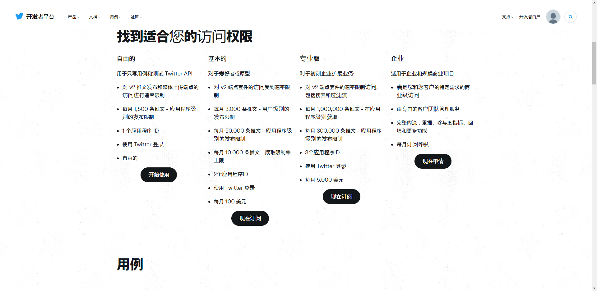
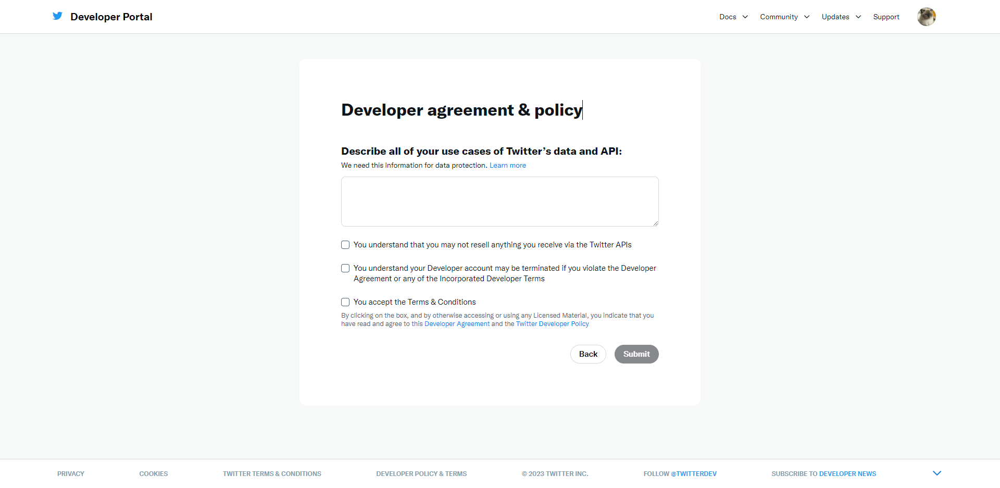
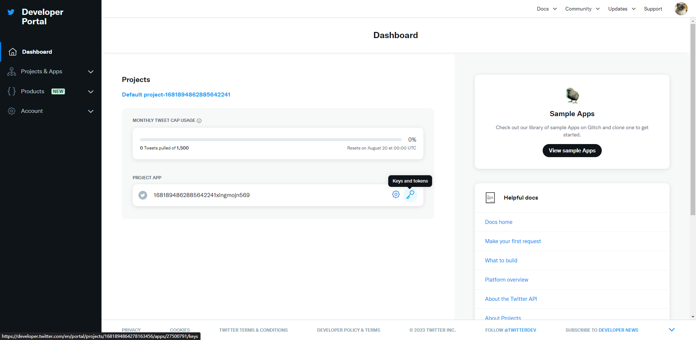
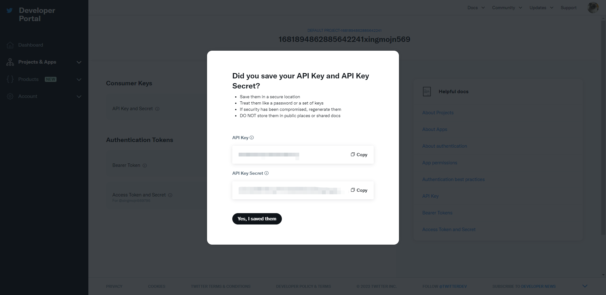
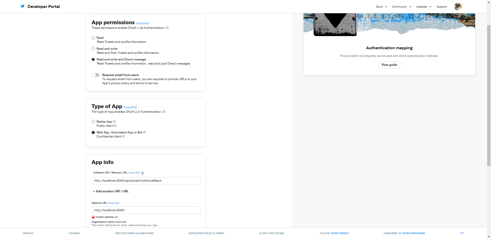

# 社交媒体三方平台
## Twitter
### 接入前准备流程
1. 申请Twitter账号,访问[开发者平台](https://developer.twitter.com/en)并点击订阅
2. 订阅选择套餐,,此处为了演示我选择免费套餐.套餐如下图
3. 填写描述信息,点击提交
> 参考示例:
> ```text
> As a platform developer, my use cases of Twitter's data and API include integrating real-time tweets into applications,
> allowing users to view and interact with trending topics, hashtags, and user profiles. Additionally, I leverage the API to enable users to post tweets, 
> schedule tweets, and access their timelines. Analyzing user sentiment, engagement metrics, and trending content helps optimize content strategies.
> I also utilize Twitter's data to gather insights for research and sentiment analysis. Ensuring compliance with Twitter's data usage policies and user privacy is a priority in all use cases.
> ```
4. 点击`Keys and tokens`,Regenerate重新生成`API Key`和`API Key Secret`,保存下来
5. 点击`User authentication settings`模块下的`Set up`按钮,配置`Twitter`授权登录的必填信息
6. 保存后会生成`Client ID`和`Client Secret`,保存下来

### 接入工作
1. 导入Twitter API依赖
```xml
<!--twitter-->
<dependency>
    <groupId>org.twitter4j</groupId>
    <artifactId>twitter4j-core</artifactId>
    <version>4.1.2</version>
</dependency>
```
2. 参考[Twitter API](https://developer.twitter.com/en/docs/twitter-api/tweets/manage-tweets/introduction)官方文档和[twitter4j](https://github.com/Twitter4J/Twitter4J/tree/main/twitter4j-examples/src/main/java/examples)编写代码
- 创建授权凭据
```java
ConfigurationBuilder cb = new ConfigurationBuilder();
cb.setDebugEnabled(true)
        .setOAuthConsumerKey(CONSUMER_KEY)
        .setOAuthConsumerSecret(CONSUMER_SECRET)
        .setOAuthAccessToken(ACCESS_TOKEN)
        .setOAuthAccessTokenSecret(ACCESS_TOKEN_SECRET);

TwitterFactory tf = new TwitterFactory(cb.build());
Twitter twitter = tf.getInstance();
```
- 访问API接口
```java
/**
 * 获取用户时间线
 */
User user = twitter.verifyCredentials();
System.out.println("Welcome, @" + user.getScreenName() + "!");

Paging paging = new Paging(1, 10); // Get the first 10 tweets on the user's timeline
ResponseList<Status> timeline = twitter.getUserTimeline(paging);

for (Status status : timeline) {
    System.out.println(status.getText());
}
```