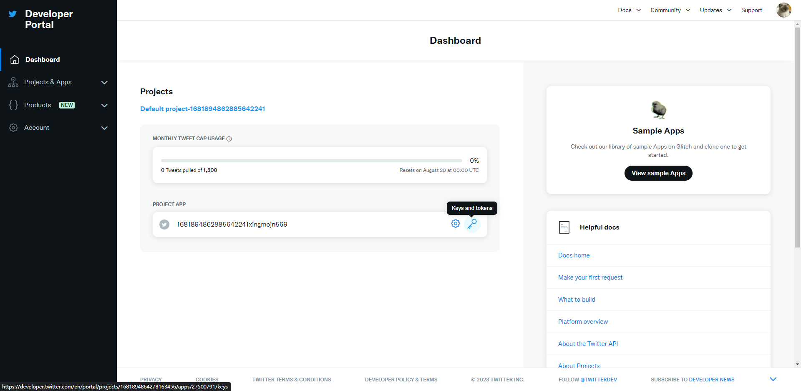
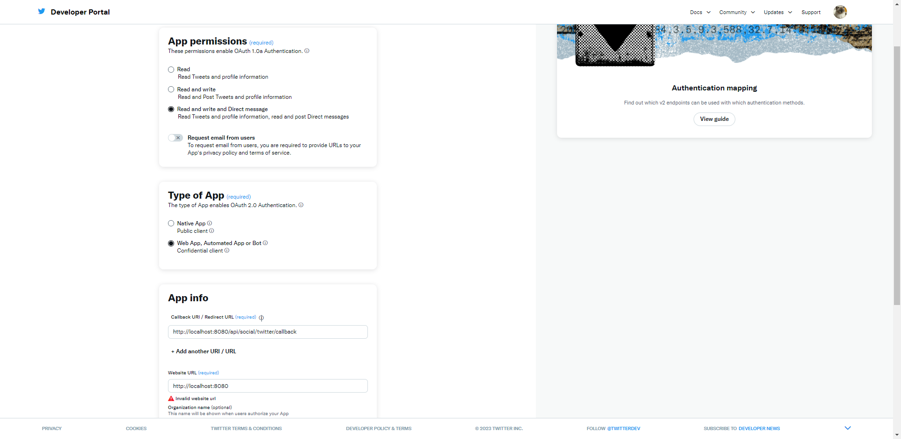
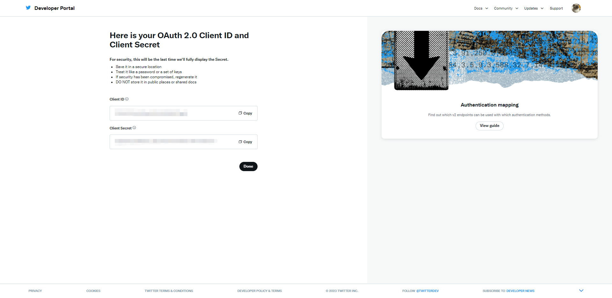

# 社交媒体三方平台
## Youtube
### 接入前准备流程
1. 申请Google账号,访问[谷歌云平台](https://console.cloud.google.com/)
2. 在导航栏中找到`API和服务`,点击进入`已启用的API和服务`,搜索`YouTube Data API v3`
3. 点击进入`YouTube Data API v3`,点击`启用`
4. 进入`YouTube Data API v3`API/服务详情,点击创建凭据
5. 勾选用户数据,点击下一步,填写每一个步骤的信息,在第五步下载凭证,最后点击完成
> 注意,在范围中选择`YouTube Data API v3`的部分,按需选择
6. 下载凭证后,将凭证放入项目的`config`文件夹中,并重命名为`client_secret.json`

### 接入工作
1. 导入YouTube API依赖
```xml
<!--Youtube-->
<dependency>
    <groupId>com.google.apis</groupId>
    <artifactId>google-api-services-youtube</artifactId>
    <version>v3-rev20230123-2.0.0</version>
</dependency>
<dependency>
    <groupId>com.google.api-client</groupId>
    <artifactId>google-api-client-gson</artifactId>
    <version>2.2.0</version>
</dependency>
```
2. 参考[YouTube API](https://developers.google.com/youtube/v3/docs?hl=zh-cn)官方文档,编写代码
- 创建授权凭据(准备工作中的client_secret.json文件)
- 确定访问权限范围
- 运行授权请求
```java
List<NameValuePair> parameters = new ArrayList<>();
parameters.add(new BasicNameValuePair("code", code));
parameters.add(new BasicNameValuePair("client_id", clientSecrets.getWeb().getClientId()));
parameters.add(new BasicNameValuePair("client_secret", clientSecrets.getWeb().getClientSecret()));
parameters.add(new BasicNameValuePair("grant_type", "authorization_code"));
parameters.add(new BasicNameValuePair("redirect_uri",redirectUri));
UrlEncodedFormEntity encodedFormEntity = new UrlEncodedFormEntity(parameters, StandardCharsets.UTF_8.name());

String url = "https://oauth2.googleapis.com/token";
HttpPost request = new HttpPost();
request.setEntity(encodedFormEntity);
String response = HttpClientUtil.doPost(url, encodedFormEntity);
System.out.println(response);
TokenResponse tokenResponse = JSON.parseObject(response,TokenResponse.class);
Credential credential = flow.createAndStoreCredential(tokenResponse, state);

CREDENTIAL_MAP.put(state,credential);
```
- 访问API接口
```java
/**
* 上传视频接口
* @return
*/
Credential credential = YoutubeAuthController.CREDENTIAL_MAP.get(uid);
YouTube youtubeService =  new YouTube.Builder(httpTransport, jsonFactory, credential).build();

Video uploadedVideo = new Video();
VideoStatus status = new VideoStatus();
status.setPrivacyStatus("public");
uploadedVideo.setStatus(status);
VideoSnippet snippet = new VideoSnippet();
snippet.setTitle(file.getOriginalFilename());
uploadedVideo.setSnippet(snippet);
InputStreamContent mediaContent =new InputStreamContent("application/octet-stream",new BufferedInputStream(file.getInputStream()));

YouTube.Videos.Insert videoInsert = youtubeService.videos().insert("snippet,status,id,player", uploadedVideo, mediaContent);
MediaHttpUploader uploader = videoInsert.getMediaHttpUploader();
uploader.setDirectUploadEnabled(false);
MediaHttpUploaderProgressListener progressListener = e -> {
switch (e.getUploadState()) {
    case INITIATION_STARTED:
    System.out.println("Initiation Started");
    break;
    case INITIATION_COMPLETE:
    System.out.println("Initiation Completed");
    break;
    case MEDIA_IN_PROGRESS:
    System.out.println("Upload in progress");
    System.out.println("Upload percentage: " + e.getProgress());
    break;
    case MEDIA_COMPLETE:
    System.out.println("Upload Completed!");
    break;
    case NOT_STARTED:
    System.out.println("Upload Not Started!");
    break;
    }
};
uploader.setProgressListener(progressListener);
videoInsert.execute();
```

## Twitter
### 接入前准备流程
1. 申请Twitter账号,访问[开发者平台](https://developer.twitter.com/en)并点击订阅
2. 订阅选择套餐,,此处为了演示我选择免费套餐.套餐如下图
3. 填写描述信息,点击提交
> 参考示例:
> ```text
> As a platform developer, my use cases of Twitter's data and API include integrating real-time tweets into applications,
> allowing users to view and interact with trending topics, hashtags, and user profiles. Additionally, I leverage the API to enable users to post tweets, 
> schedule tweets, and access their timelines. Analyzing user sentiment, engagement metrics, and trending content helps optimize content strategies.
> I also utilize Twitter's data to gather insights for research and sentiment analysis. Ensuring compliance with Twitter's data usage policies and user privacy is a priority in all use cases.
> ```
4. 点击`Keys and tokens`,Regenerate重新生成`API Key`和`API Key Secret`,保存下来
5. 点击`User authentication settings`模块下的`Set up`按钮,配置`Twitter`授权登录的必填信息
6. 保存后会生成`Client ID`和`Client Secret`,保存下来

### 接入工作
1. 导入Twitter API依赖
```xml
<!--twitter-->
<dependency>
    <groupId>org.twitter4j</groupId>
    <artifactId>twitter4j-core</artifactId>
    <version>4.1.2</version>
</dependency>
```
2. 参考[Twitter API](https://developer.twitter.com/en/docs/twitter-api/tweets/manage-tweets/introduction)官方文档和[twitter4j](https://github.com/Twitter4J/Twitter4J/tree/main/twitter4j-examples/src/main/java/examples)编写代码
- 创建授权凭据
```java
ConfigurationBuilder cb = new ConfigurationBuilder();
cb.setDebugEnabled(true)
        .setOAuthConsumerKey(CONSUMER_KEY)
        .setOAuthConsumerSecret(CONSUMER_SECRET)
        .setOAuthAccessToken(ACCESS_TOKEN)
        .setOAuthAccessTokenSecret(ACCESS_TOKEN_SECRET);

TwitterFactory tf = new TwitterFactory(cb.build());
Twitter twitter = tf.getInstance();
```
- 访问API接口
```java
/**
 * 获取用户时间线
 */
User user = twitter.verifyCredentials();
System.out.println("Welcome, @" + user.getScreenName() + "!");

Paging paging = new Paging(1, 10); // Get the first 10 tweets on the user's timeline
ResponseList<Status> timeline = twitter.getUserTimeline(paging);

for (Status status : timeline) {
    System.out.println(status.getText());
}
```